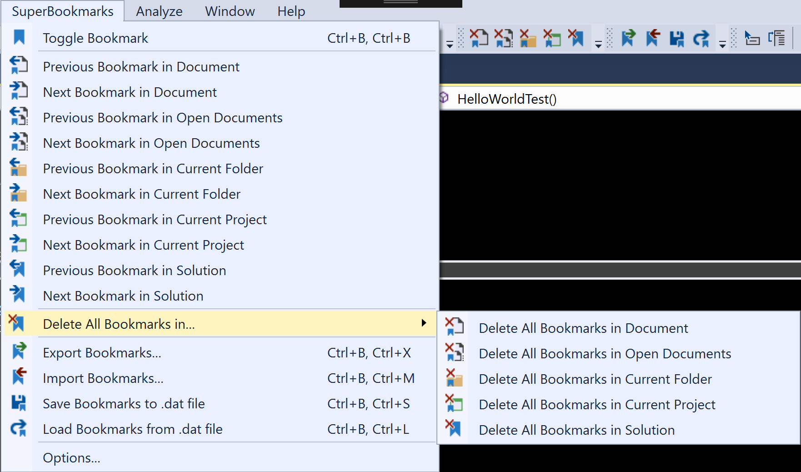
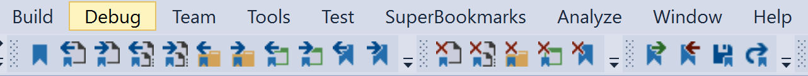
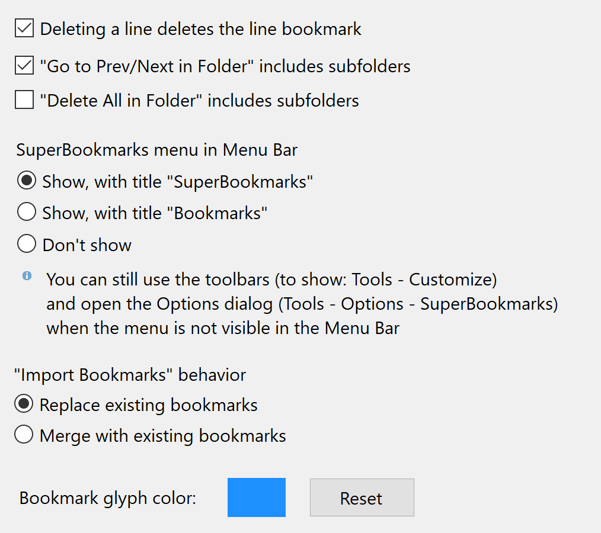
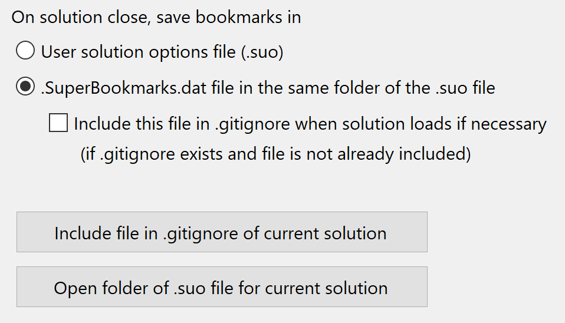
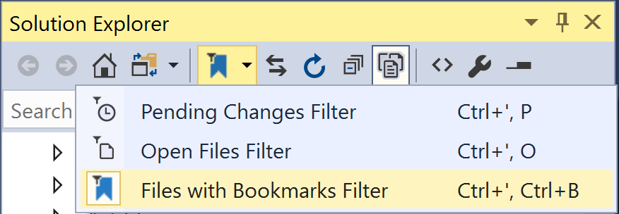

# SuperBookmarks

SuperBookmarks is a state-of-the-art code bookmarks manager for Visual Studio 2017. It basically works the same way as the standard bookmarks engine that ships with Visual Studio: you create a bookmark for the current line of the current document via the appropriate menu entry, these bookmarks are displayed as a glyph in the margin of the editor, and you can navigate to the previous/next bookmark by using other menu entries. However SuperBookmarks provides the following extra features:

* **Advanced navigation and deletion options.** You can navigate to the previous/next bookmark in the current document, across all open documents, across documents in the folder of the current document, across documents in the current project, and of course across documents in the whole solution. And the same when deleting bookmarks.

Additionally to the main menu, the commands are also available in three toolbars (activate them via Tools - Customize - Toolbars).

* **Customization.** You can configure the bookmark glyphs color and other aspects of the extension behavior, you can access the options page through the "Options" command in the "SuperBookmarks" menu.

* **Store bookmarks in separate file**. By default, SuperBookmarks will store all the bookmarks for the solution in the Solution User Options (.suo) file when the solution is closed, and will retrieve them from the same place when the solution loads next time; that is, exactly the same way as the standard Visual Studio bookmarks. However, you have the option to store the bookmarks in a separate file instead. That way, if for some reason you need to delete the .suo file (because a faulty extension or a bug in Visual Studio is preventing you from opening the solution - this happens from time to time) you won't lose your bookmarks.

If you choose to store bookmarks in a separate file, you can use the _Save Bookmakrs to .dat file_ and _Load Bookmarks from .dat file_ commands in order to save or load the bookmarks immediately, without having to wait until the solution is closed/reopened.

* **Export and import bookmarks**. Additionally to the automated process of saving the bookmarks in the .suo or .dat file, you have the option to manually export or import the bookmarks to/from a file at any time. That's useful if you want to switch to a different working context (you are working on a new feature but you need to switch to bug hunting mode in a different part of the same codebase, for example) or if you want to share a set of bookmarks with a colleague. These are plain JSON files, by the way.

* **"Files with Bookmarks" filter in Solution Explorer**. By using this filter you will see only the files that currently have at least one bookmark.

## Known issues

* The _"Go to Prev/Next in Folder" includes subfolders_ option is not very useful in its actual form. The _Go to Prev/Next in Current Folder_ commands always act relative to the folder of the currently focused document, and once you've gone to the deepest folder level there's no way to go back by using these commands (you need to manually select a different file). There should be a mechanism to "pin" a folder for these commands.

* Unlike with Visual Studio's built-in bookmarks engine, you can't enable/disable bookmarks, and there's no tool window to manage the existing bookmarks.

## Future plans

* Create a mechanism to easily switch between bookmark sets, without having to explicitly export to/import from files.
* Create a tool window to manage existing bookmarks.
* Annotations for bookmarks.

## Last but not least...

I am [this weird guy](http://stackoverflow.com/users/4574/konamiman?tab=profile) and [my kids are shoe slayers](http://www.konamiman.com/msx/msx-e.html#donate).